# Introduction
This repo is created in support of my blog post 'Achieve Code Consistency: MegaLinter Integration in Azure DevOps' on Microsoft Tech Community.

## Requirements
If you want to use this solution to lint your files when submitting a PR, the following prerequisites must be met:
- Project Settings | Pipelines | Settings | Protect access to repositories in YAML pipelines = Disabled

### Permissions for repositories
- Project Settings | Repositories | Settings | Security (for all or specific repos):
    Project Collection Build Service (OrgName) - Contribute to pull requests (Allow)
    Project Collection Build Service (OrgName) - Read (Allow)

### Branch Policy
Configure a branch policy for the main branch in the repo that you want to have linted.
    Repos | Branches | Main | Branch Policies | Build Validation
        Select the Mega-linter pipeline in the central repo and set display name
        leave other settings default

# Step-by-step instructions

## Import repository
In your Azure DevOps project, go to Repos and select 'import repository' from the dropdown list:
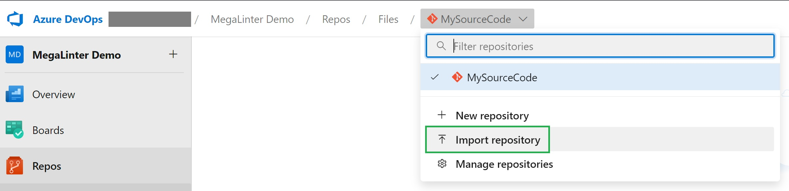

Goto https://github.com/donkoning/megaLinter, click '<> Code'  and copy the web URL:
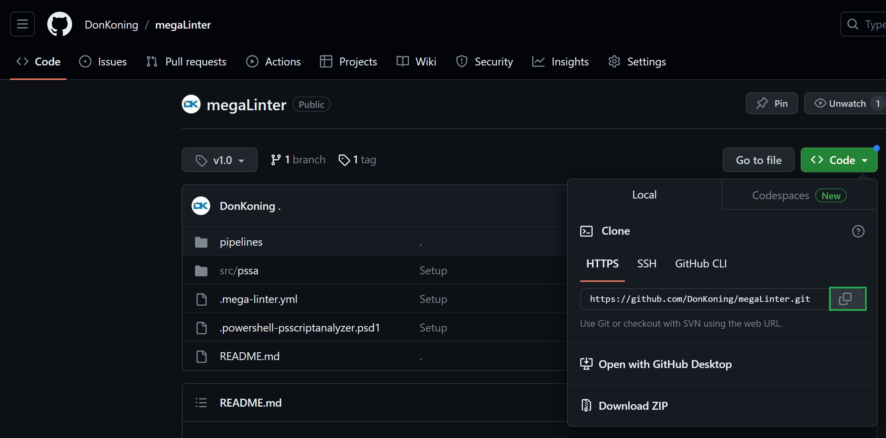

Paste the web URL in the 'import a GIT repository' interface:
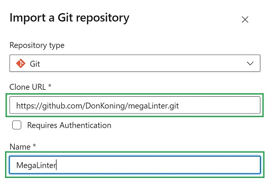

Once imported, the result should look like this:
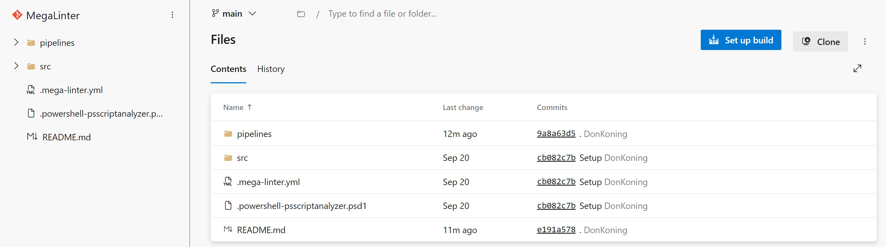

## Modify pipeline variables
The pipelines/megaLinterCentral.yml pipeline has two variables that you need to modify for your environment:

variables:
  adoOrg: '<Enter your ADO Organisation name here>'
  adoProject: '<Enter your ADO project Name here>'

Replace the placeholder test with your Azure DevOps organization name and project name and commit the changes.

## Configure your Azure DevOps Project
As described in the requirements, the following settings need to be modified in your project:

Open 'Project Settings | Pipelines | Settings' and disable the setting 'Protect access to repositories in YAML pipelines':
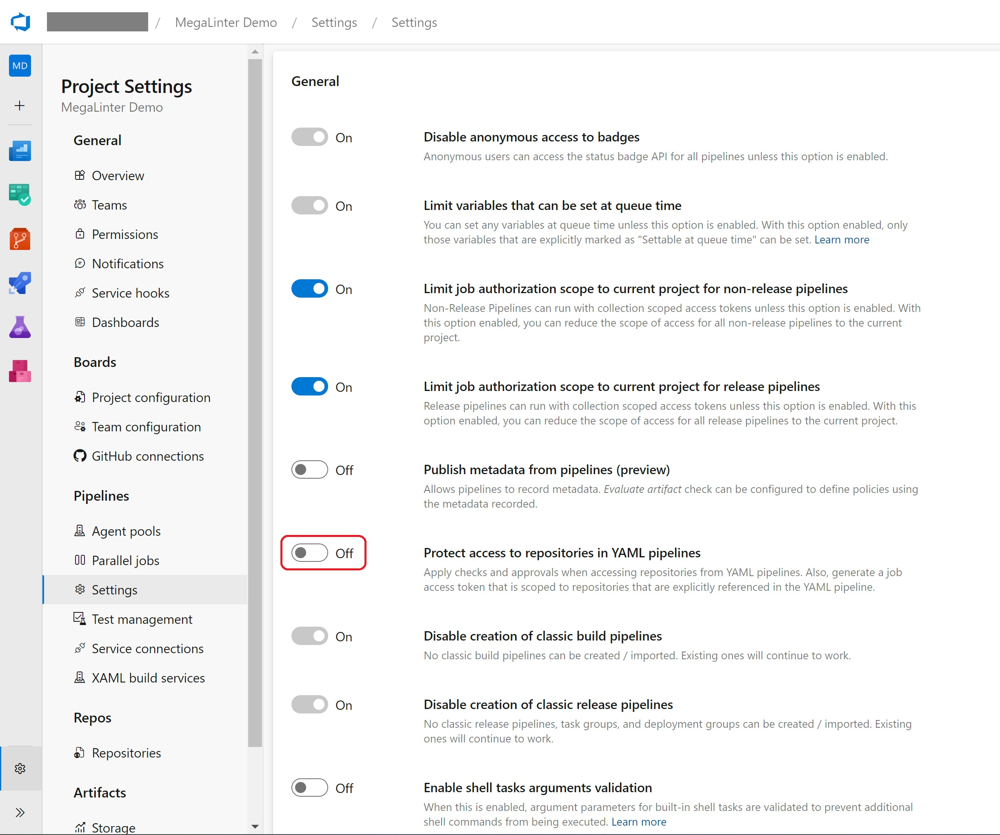

Next, go to 'Project Settings | Repos | Repositories'. If you want to set default permissions for all repos, select the 'Security' tab, otherwise select the source repo and then the 'Security' tab.

For the 'Project Collection Build Service (OrgName)' set the permission 'Contribute to pull requests' to 'Allow'.
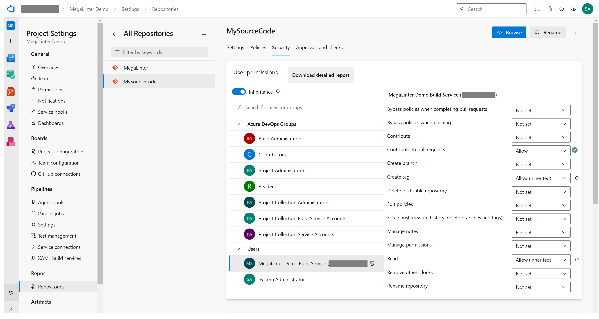

Next step is to add the MegaLinter pipeline, so that we can select it in our Build Validation policy.
Go to 'Pipelines' and select 'New pipeline'. Select 'Azure Repos Git' as the location of your code.
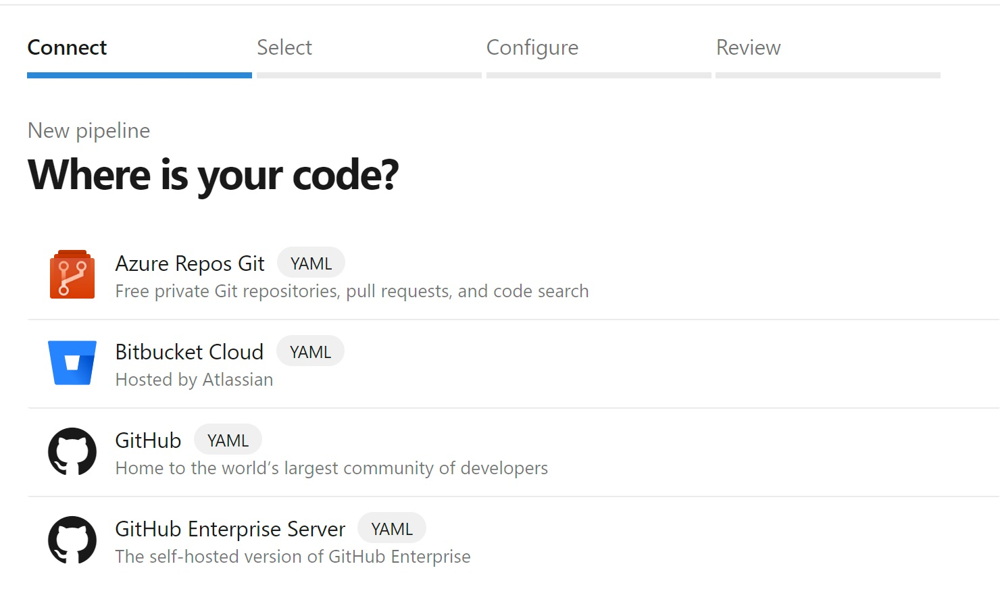

Select the 'MegaLinter' repository that contains the pipeline.
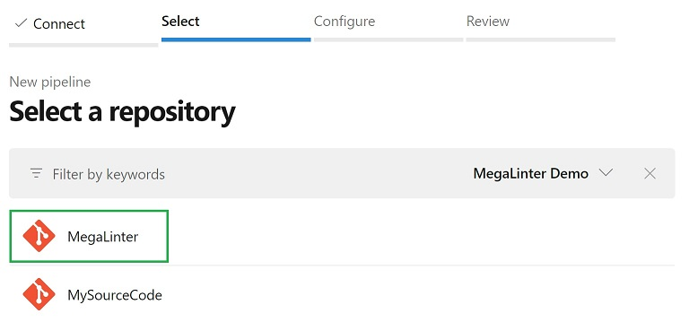

Select 'Existing Azure pipelines YAML file' and select the /pipelines/megaLintercentral.yml' pipeline:
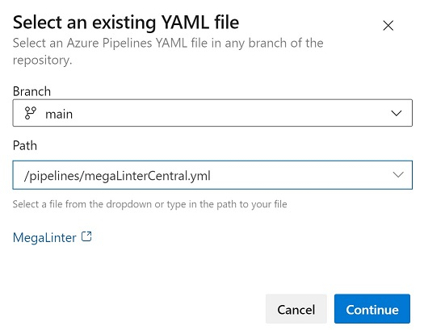

Continue and save (not run) the pipeline.

## Build Validation policy
Finally, we need to create a Build Validation policy for our source repository. Go to 'Project Settings | Repos | Repositories' and select your source repo. Select the 'Policies' tab and click the main branch name under 'Branch Policies':
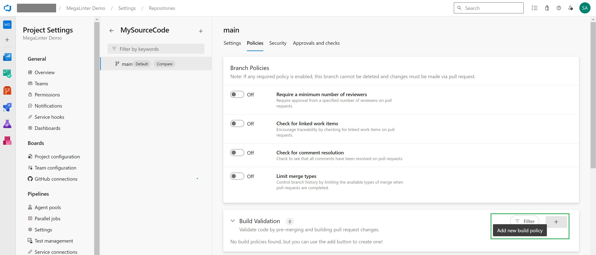

Click the '+' sign to add your build policy. Select the MegaLinter build pipeline, set your policy requirement, display name and click 'save'.
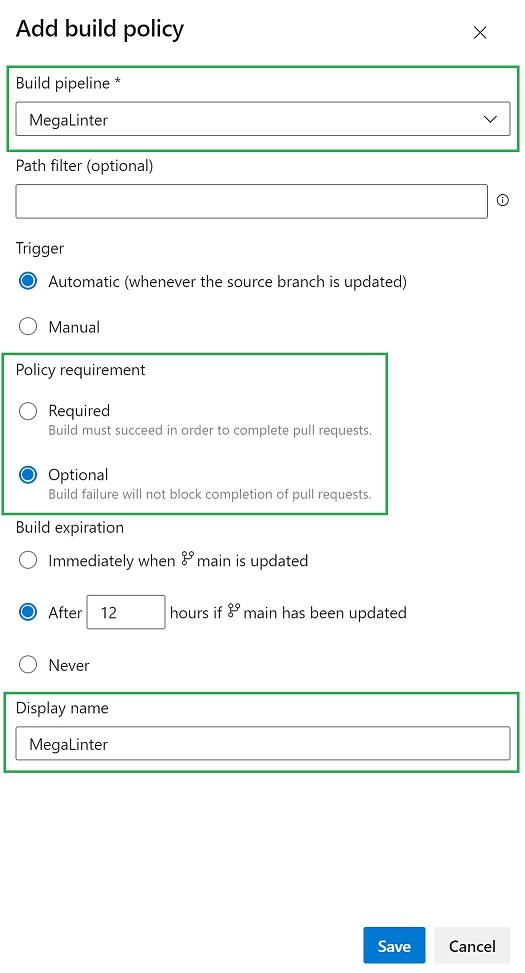

Now, you're ready to test the setup.

## Testing
Create a new branch in your source repo and make some changes. When submitting a PR the MegaLinter pipeline should run:
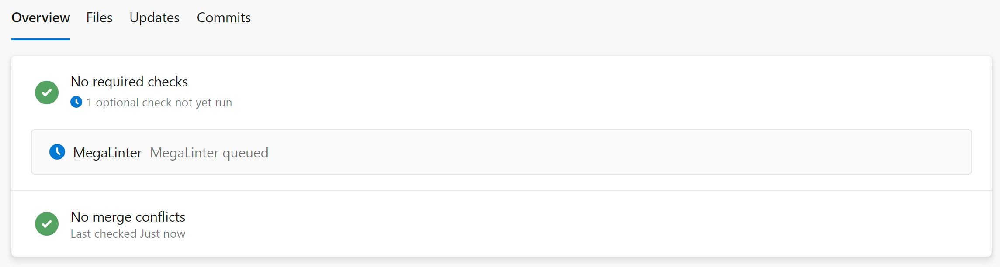

When the MegaLinterCentral pipeline has finished the findings should be reported back to the PR as a comment:
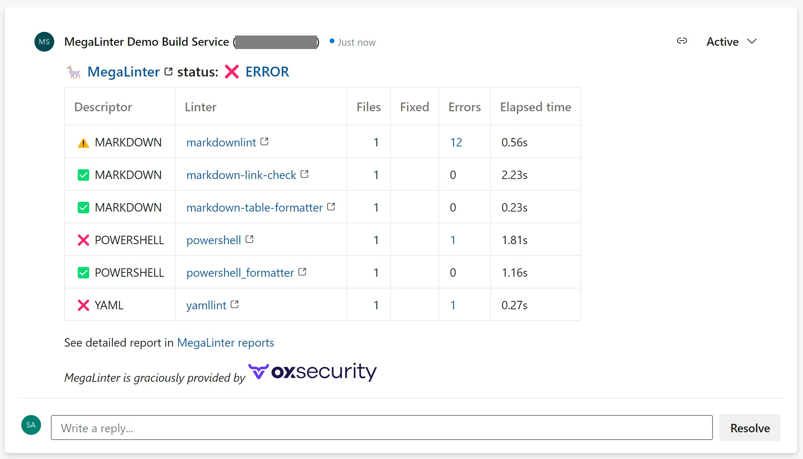

In addition, the reports should also be saved as artifacts in your build:
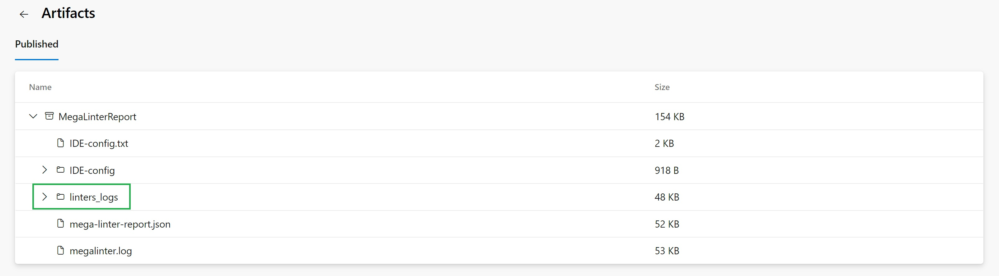

Done!
